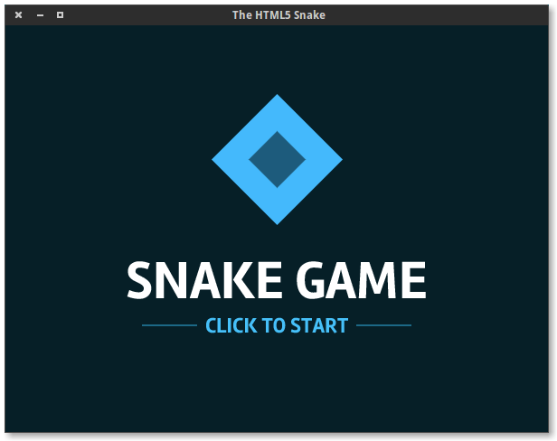
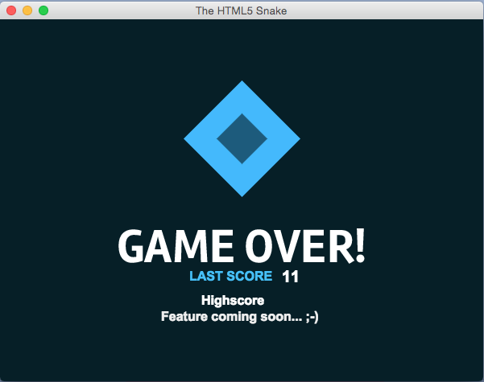

#PhaserSnake

> v 0.1 Alpha

## About this game.

This little game is a game of snake. I made it to start learning HTML5 game development. I encourage you to do the same.
As a further exercise, I packaged it into a node-webkit application. Otherwise, you could just open the index.html in your browser with a server appended.
I hope you have fun playing it ! If you know how to code and would like to help, please feel free to create a pull request at <https://github.com/N07070/PhaserSnake>

## Downloads

A binary is included with this git repo. You can download yours in the `build/nw-app/` folder. I only currently support Linux 64, but you can build and play with osx 64 and win64, but if's there is a bug I might not fix it. Please feel free to submit code if you find a bug & fix for it. Thanks !

### Linux



### OS X



### Windows


## License

```
PhaserSnake
Copyright (C) 2015  N07070

This program is free software: you can redistribute it and/or modify
it under the terms of the GNU General Public License as published by
the Free Software Foundation, either version 3 of the License, or
(at your option) any later version.

This program is distributed in the hope that it will be useful,
but WITHOUT ANY WARRANTY; without even the implied warranty of
MERCHANTABILITY or FITNESS FOR A PARTICULAR PURPOSE.  See the
GNU General Public License for more details.

You should have received a copy of the GNU General Public License
along with this program.  If not, see <http://www.gnu.org/licenses/>.
```
